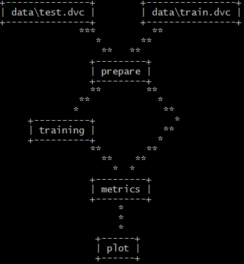

# DVCLabAssignment

Repository for the Social computing lab assignment. It is done with the purpose of a Pipeline creation from "Classification on raw time series in TensorFlow with a LSTM RNN".
The purpose of the notebook was to recognize the human activity using smartphones dataset and an LSTM RNN. Classifying the type of movement amongst six categories:

WALKING,
WALKING_UPSTAIRS,
WALKING_DOWNSTAIRS,
SITTING,
STANDING,
LAYING.

The pipeline has 4 stages:

- Prepare:
  In this stage the dataset are prepared. Actually the downloaded dataset was already in a splitted form (train/test) so the process is simulated saving the training set and the    testing set.

- Training:
  In this stage the LSTM RNN is build and trained.

- Metrics:
  In this stage the metrics are computed and the output is composed by the confusion matrix and the normalized confusion matrix.

- Plot:
  In this stage the confusion matrix is plotted and the image is saved.

# Setup

To reproduce the Pipeline follow this steps:

### Step 1:
   -Create a new directory
### Step 2:
   -Go inside the new directory with the command prompt
### Step 3:
   -Use the following command
 
 `git clone https://github.com/StefanoCamp/DVCLabAssignment.git`
 
 To clone the repository.
### Step 4:
   -Go inside the directory DVCLabAssignment
 
 `cd DVCLabAssignment`

### Step 5:
   -Create a Python virtual environment (This work was done in windows with python 3.8)
 
 `python -m venv virtualenv`

### Step 6:
   -Activate the virtual environment
 
 Mac OS / Linux:
    `source virtualenv/Scripts/Activate`
    
 Windows
    `virtualenv/Scripts/Activate`
 
 if with windows there is any problem use
    `"virtualenv/Scripts/Activate"`
 As explained here https://support.microsoft.com/en-us/topic/batch-files-run-from-within-other-folders-may-fail-adc78247-1834-1a49-6a38-27a716c1ace1

### Step 7:
   -Install the requirements using
   
   `pip install -r src/requirements.txt`

### Step 8:
   -Pull the necessary file from the remote storage using
   
   `dvc pull`

It is a public folder so everyone has the link can access to it. Follow the instruction for the Autenthication.

# Run the Pipeline

## Step 9:
   -Reproduce the Pipeline with
   
   `dvc repro -- force`
   
to force the execution or

   `dvc repro`
   
to reproduce if there are any changes.

You can modify the parameters from the params.yaml file. Moreover, you can use the command
  
  `dvc dag`
  
to see the pipeline.

